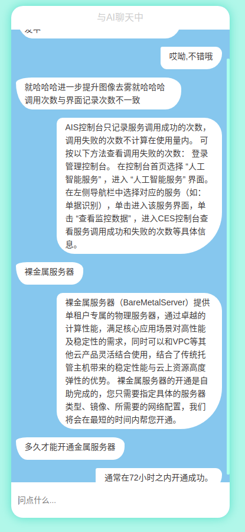
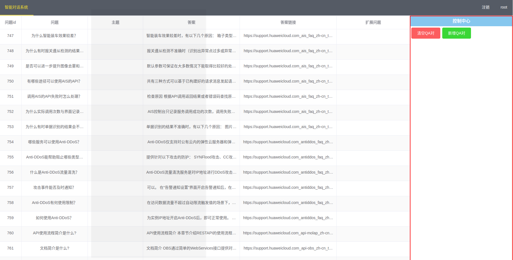

# Intelligent-question-answering-system
an intelligent question answering system 

### Competition Title's link 
http://www.cnsoftbei.com/bencandy.php?fid=151&aid=1612

**********************

### 图片展示

#### 交互界面展示



#### QA对管理界面展示




**********************

### 项目启动
```
cd be/
npm install 
composer install
cp .env.example .env
php artisan key:generate
php artisan serve
```

**********************

### 待做

- 使用react-native构建成APP
- 加入redis
- 使用tf/cnn对用户输入提取特征


**********************


### 参考链接

- [结巴中文分词](https://github.com/fxsjy/jieba)
- [结巴分词4--词性标注](http://www.cnblogs.com/zhbzz2007/p/6165442.html)
- [jieba分词 词性标记含义](https://blog.csdn.net/qq_19707521/article/details/78431745)
- [PyMySQL](https://github.com/PyMySQL/PyMySQL)
- [Python爬虫利器二之Beautiful Soup的用法](https://cuiqingcai.com/1319.html)
- [使用CSS美化Chrome下的滚动条样式](https://blog.csdn.net/u014291497/article/details/74937783)
- [TF-IDF与余弦相似性的应用（一）：自动提取关键词](http://www.ruanyifeng.com/blog/2013/03/tf-idf.html)
- [TF-IDF与余弦相似性的应用（二）：找出相似文章](http://www.ruanyifeng.com/blog/2013/03/cosine_similarity.html)
- [python使用gensim进行文本相似度计算](https://blog.csdn.net/lom9357bye/article/details/73136117)
- [PHP中exec,system等函数调用系统命令详解](https://my.oschina.net/junn/blog/93028)
- [exec](http://php.net/manual/zh/function.exec.php)
- [PHP带参数传值调用python脚本](http://www.zongk.com/zongk/95.html)
- [pymysql（一）检索、增加、更新、删除数据](https://blog.csdn.net/m0_37422217/article/details/76696740)
- [Composer 安装与使用 | 菜鸟教程](https://www.runoob.com/w3cnote/composer-install-and-usage.html)
